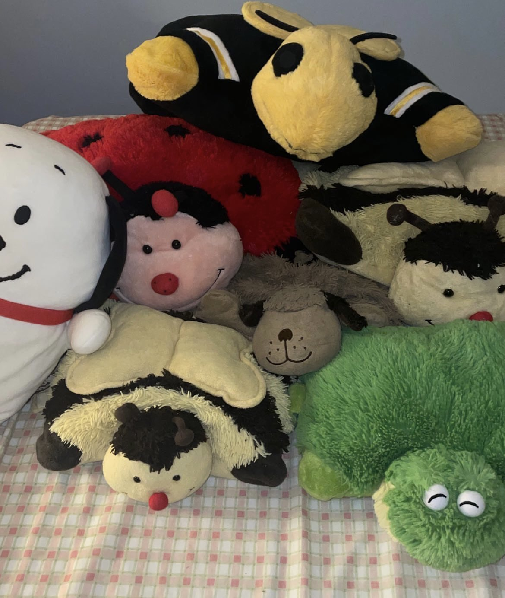

# Sean Ting's User Page
## Table of Contents
1. [Programming Experience](https://github.com/sjting8/sjting8.github.io/blob/main/index.md#programming-experience)
2. [Who am I outside of programming?](https://github.com/sjting8/sjting8.github.io/blob/main/index.md#who-am-i-outside-of-programming)
### Programming Experience?
I'm currently a second-year CS Major in Warren. I've had exposure to programming/computer science throughout my whole life but never really delved deep into a specific field, so I'm excited to start looking into specializations. I have a _little_ experience with **React/Typescript** and I have some exposure to **Django** (Django REST Framework) which may or may not help me in this course. In terms of frontend development, I'm also familiar with `mui`.
> C++ is my favorite language, though as written in [this](README.md).
### Who am I outside of programming?
I love Pillow Pets.

[My Spotify Profile](https://open.spotify.com/user/sjting8?si=8a5ce23df9a348ae)

My hobbies include:
- baking
     - [x] brownies
     - [x] muffins
     - [x] focaccia
     - [x] blondies
     - [x] cookies
     - [ ] pie
     - [ ] cake
     - [ ] sourdough
- piano
     - [x] Liebestraum
     - [x] Prelude in C-Sharp Minor
     - [x] Revolutionary Etude
     - [ ] Winter Wind
     - [ ] Un Sospiro
     - [ ] Ballad No. 1 in G Minor
- climbing
- calisthenics
- digital art
- video games

My favorite cat/dog breeds in order are:
1. Chow chow dogs
2. Persian cats
3. Minuet cats
4. Siberian cats
5. Ragdolls
6. British Longhair/Shorthair cats
7. Samoyed dogs
8. Huskies
9. Everything else
